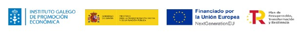

# eHabilis Help Chatbot – Proyecto de I+D+i en Inteligencia Artificial

Proyecto financiado por la Unión Europea – NextGenerationEU y apoyado por el
Instituto Galego de Promoción Económica (IGAPE)

**Objetivo del proyecto**: El objetivo principal es el diseño, entrenamiento e implementación de un núcleo tecnológico avanzado basado en Inteligencia Artificial (NLU/ML) para el ecosistema eHabilis KMS. Este sistema de asistencia conversacional inteligente permitirá un razonamiento semántico complejo y la resolución autónoma de consultas, elevando el nivel de madurez tecnológica de nuestras soluciones a un entorno operativo real.

**Financiación**: Este proyecto ha sido financiado por la Unión Europea – NextGenerationEU, a través del Plan de Recuperación, Transformación y Resiliencia (PRTR) y apoyado por el Instituto Galego de Promoción Económica (IGAPE) dentro de la convocatoria de Ayudas IA360 para el desarrollo tecnológico y la innovación mediante el uso de la Inteligencia Artificial.

